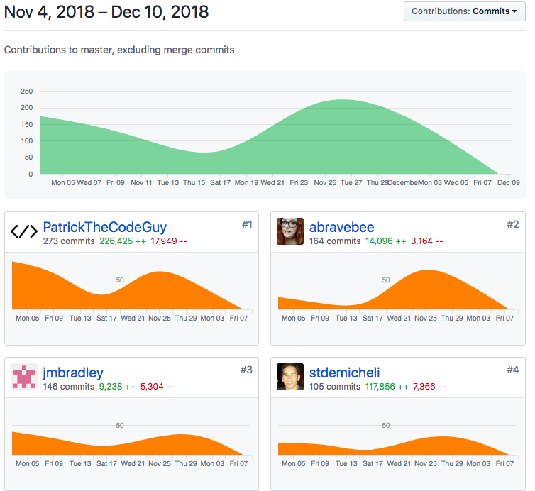

# Look Back

The prior week was extremely challenging in so far as just the amount of code that needed to be pushed. However, this week was challenging for the typical reasons that define the "80/20 rule." We have mostly completed the project except for some basic aesthetic tweaks and reassessment of page layout that needs to happen. I have found it challenging to concentrate on the smaller tasks. Additionally, I have found it hard to project the time commitment for each task. I would like to focus on this as I continue down the path as a developer. 

### Thoughts on next week

We have had numerous meetings with our iOS folks because it seems that aesthetically they have excelled in this project. We need to firm up the look and feel of our app and bring it closer to the look and feel of their application. If our goal is symmetry, this will be important.

## Whiteboarding
Week Three of White Boarding was a little tougher than anticipated. The problem was Product of All Numbers. The goal of the challenge was to create a function that could iterate through an array and multiply all numbers in the array except the current array index, then place the product of that multiplication in at the current index position, advance to the next index position and repeat. I found it to be more challenging than it should have been!
- (https://vimeo.com/user92307089/review/305475309/abaffe912c "Whiteboarding Week Three")

## Tasks Pulled
### Front End
 - (https://github.com/Lambda-School-Labs/Labs8-MealHelper/pull/116 "Front End PR One")
 - (https://github.com/Lambda-School-Labs/Labs8-MealHelper/pull/120 "Front End PR Two")
 - (https://github.com/Lambda-School-Labs/Labs8-MealHelper/pull/123 "Front End PR Three")
 - (https://github.com/Lambda-School-Labs/Labs8-MealHelper/pull/124 "Front End PR Four")
 - (https://github.com/Lambda-School-Labs/Labs8-MealHelper/pull/125 "Front End PR Five")
 - (https://github.com/Lambda-School-Labs/Labs8-MealHelper/pull/127 "Front End PR Six")
 - (https://github.com/Lambda-School-Labs/Labs8-MealHelper/pull/131 "Front End PR Seven")
 - (https://github.com/Lambda-School-Labs/Labs8-MealHelper/pull/140 "Front End PR Eight")
 - (https://github.com/Lambda-School-Labs/Labs8-MealHelper/pull/142 "Front End PR Nine")
 - (https://github.com/Lambda-School-Labs/Labs8-MealHelper/pull/150 "Front End PR Ten")
 - (https://github.com/Lambda-School-Labs/Labs8-MealHelper/pull/161 "Front End PR Eleven")
 - (https://github.com/Lambda-School-Labs/Labs8-MealHelper/pull/162 "Front End PR Twelve")
 

### Back End

- (https://github.com/Lambda-School-Labs/Labs8-MealHelper/pull/114 "Back End PR One")

