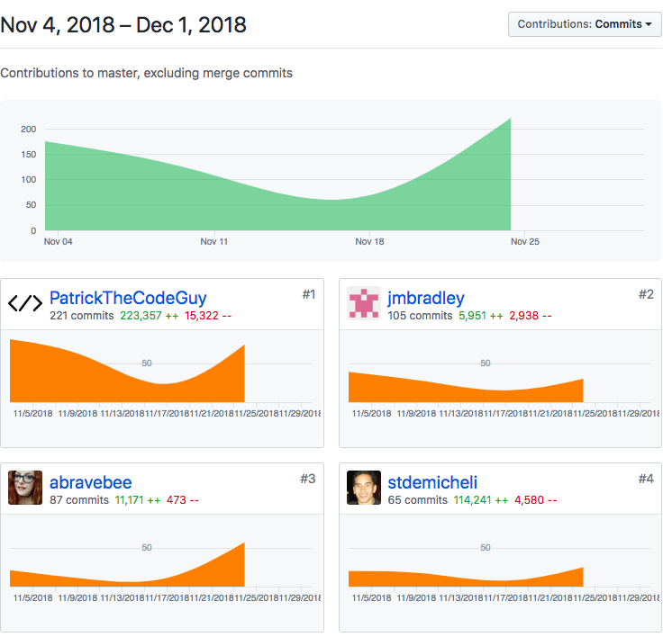

# Look Back

This week was the heaviest week that we have had to date. We had to have our project reach full feature set by the end of the week. This included lots of work refactoring our endpoints due the fact that our approach to handling some of the data in our tables had changed. 
###An interesting aside
Data handling was a huge challenge for us this week. Example: We had to figure out how to receive and array of numbers, iterate through them and trigger a POST call for each iteration. During this process we had to ensure that data integrity was maintained. Additionally, our iOS team members needed some of the data that we had to handle in this manner served up as a string. It became evident that our JS chops were finally being put to the test.

#Hopping back to the Look Back
We had a couple of challenging moments working through workflow dynamics, time zones, and tight dev schedules. Lots of co-developing...but this week really felt like work. Definitely a good thing. But we were able to get to MVP by the end of the week.

###Focus Thought
Working within the context of a diverse team has been challenging in that, while everyone is talented, some devs are motivated by stress, others do not prefer that environment. Our team is getting better at deividing work up accordingly. At any rate, glad to be a part of this crew....super sharp folks.

## Whiteboarding
Week two of whiteboarding was more intuitive and fruitful than the prior week. Beginning with pseudo code, becoming more comfortable with learning publically, and taking the time to formulate technically deeper questions. Here's a video: 
- (https://vimeo.com/user92307089/review/303751594/18057c5861 "Whiteboarding Week Two")

## Tasks Pulled
### Front End
 - (https://github.com/Lambda-School-Labs/Labs8-MealHelper/pull/89 "Front End PR One")
 - (https://github.com/Lambda-School-Labs/Labs8-MealHelper/pull/92 "Front End PR Two")
 - (https://github.com/Lambda-School-Labs/Labs8-MealHelper/pull/93 "Front End PR Three")
 - (https://github.com/Lambda-School-Labs/Labs8-MealHelper/pull/95 "Front End PR Four")
 - (https://github.com/Lambda-School-Labs/Labs8-MealHelper/pull/104 "Front End PR Five")

### Back End

- (https://github.com/Lambda-School-Labs/Labs8-MealHelper/pull/72 "Back End PR One")

