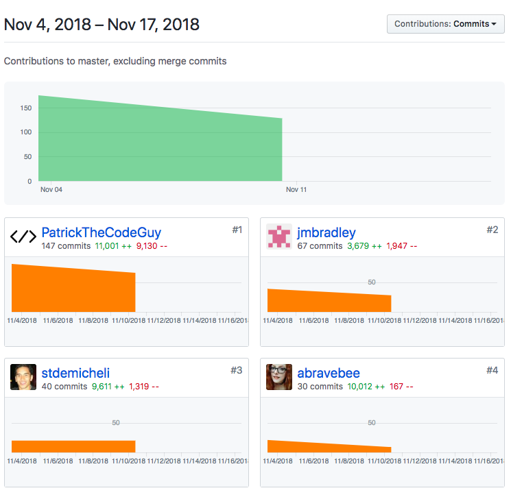

# Look Back

This week was excellent, but also quite challenging. Due to the 3 day weekend , we began wth a sligt deficit of 1 day. Our team's goal this week was to go beyond the MVP reqs and start on deeper functionality. We were able to knock the majority of the MVP reqs out by Tuesday. Casey and Patrick worked on AuthO. Haywood and I took the task of implementing the APIs necessary for the project. 

However, as with most things in software, there was a catastrophic failure on that popped up on Wed but that we did not have an accurate scope on untile Th. This bug required us to save everything locally, deconstruct our GitHub and reload only certain files in a particular order. After much examination, it appears as though the bug was the result of a quirk with MacOSs. Apparently, Mac will allow whitespace to be saved in file paths. When these file paths are then commited in GH it is disruptive in terms GH understanding which pathway is intended to be commited. The bug results in commits containing unintended files or leaving out intended files.

We were able to get through this and continue on with the project.

Our team came together in a tough time this week. I'm looking forward to working with them in the subsequent month.

## Tasks Pulled
### Front End
 - (https://github.com/Lambda-School-Labs/Labs8-MealHelper/pull/29 "Front End PR One")
 - (https://github.com/Lambda-School-Labs/Labs8-MealHelper/pull/34 "Front End PR Two")
 - (https://github.com/Lambda-School-Labs/Labs8-MealHelper/pull/39 "Front End PR Three")
 - (https://github.com/Lambda-School-Labs/Labs8-MealHelper/pull/39 "Front End PR Four")
 - (https://github.com/Lambda-School-Labs/Labs8-MealHelper/pull/44 "Front End PR Five")
 - (https://github.com/Lambda-School-Labs/Labs8-MealHelper/pull/57 "Front End PR Six")
 - (https://github.com/Lambda-School-Labs/Labs8-MealHelper/pull/59 "Front End PR Seven")
 - (https://github.com/Lambda-School-Labs/Labs8-MealHelper/pull/64 "Front End PR Eight")

### Back End

- (https://github.com/Lambda-School-Labs/Labs8-MealHelper/pull/43 "Back End PR One")
- ()